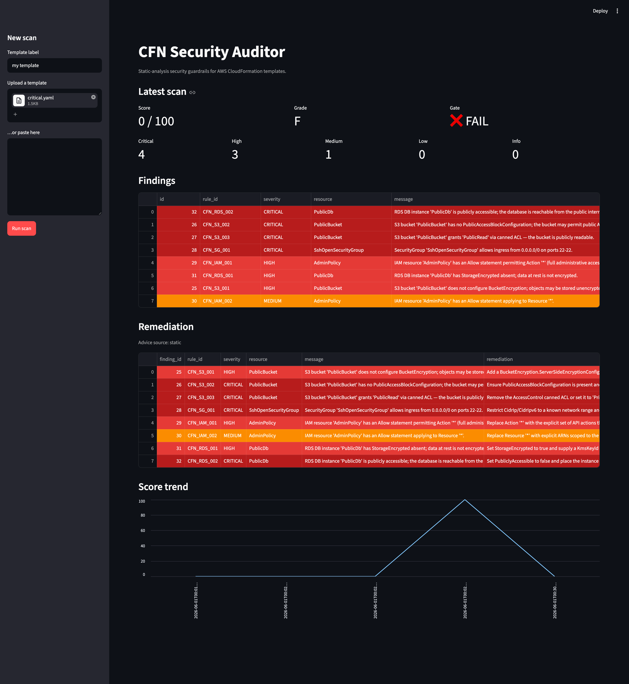

# CFN Security Auditor

API-first, Python-based **enterprise security guardrail auditor** for AWS CloudFormation templates. Performs **static analysis** offline (no AWS credentials, no boto3) and acts as a pre-deploy gate. Built around a pluggable rule registry, a FastAPI HTTP API, SQLite persistence, a Streamlit dashboard, and an optional Anthropic-backed AI Remediation Advisor.

## Why static CFN

- **Pre-deploy.** Catch misconfigurations before they reach AWS.
- **Free.** No AWS credentials, no API quotas, no cost.
- **Fast.** Parse-and-check, no network round-trips.
- **Reproducible.** Same input → same findings, every time.

## Architecture

```
                ┌──────────────┐
                │  Dashboard   │  Streamlit; pure HTTP client
                └──────┬───────┘
                       │ HTTP (X-API-Key when set)
                ┌──────▼───────┐
                │     API      │  FastAPI; auth-gated /scans, /rules
                └──────┬───────┘
                       │
   ┌───────────────────┼─────────────────────────────┐
   │                   │                             │
┌──▼──────┐   ┌────────▼────────┐         ┌──────────▼─────────┐
│ engine  │──▶│ parser + rules  │         │  advisor (RAG+LLM) │
└────┬────┘   │  Template,      │         │  static fallback   │
     │        │  Resource,      │         └────────────────────┘
     │        │  RuleFinding    │
     │        └─────────────────┘
┌────▼────┐
│ models  │  SQLModel: Scan, Finding (sqlite)
└─────────┘

observability: request-id middleware + structured JSON logging on every route
```

The dashboard speaks **only HTTP** to the API — it never imports the engine, rules, or db. The advisor is **behind a `RemediationProvider` Protocol**, so flipping from the deterministic static provider to the Anthropic LLM is an env-var change with zero UI change.



## Stack

Python 3.14 · FastAPI · SQLModel · SQLite · pydantic-settings · PyYAML · Streamlit · httpx · Anthropic SDK · pytest · ruff · black · mypy · uv.

See [`CLAUDE.md`](./CLAUDE.md) for the standing engineering contract: standards, CI commands, security rules, and merge protocol.

## Quickstart

### 1. Install

```sh
# Install uv if needed: https://github.com/astral-sh/uv
make install            # uv sync --all-extras
```

### 2. Run locally (two terminals)

```sh
# Terminal 1 — API
make api                # uvicorn :8000

# Terminal 2 — Dashboard
make dashboard          # streamlit :8501
```

### 3. Run the full stack with Docker Compose

```sh
make compose-up
# API:        http://localhost:8000
# Dashboard:  http://localhost:8501
# Stop with:  make compose-down
```

The dashboard service is wired to the API via `CFN_AUDITOR_API_URL=http://api:8000` in `docker-compose.yml`.

### 4. Scan a sample template

```sh
curl -s -X POST http://localhost:8000/scans \
  -H 'Content-Type: application/json' \
  -d @- <<'JSON' | python -m json.tool
{
  "name": "smoke.yaml",
  "template": "Resources:\n  PublicBucket:\n    Type: AWS::S3::Bucket\n    Properties:\n      AccessControl: PublicRead\n"
}
JSON
```

```sh
# List the registered rules:
curl -s http://localhost:8000/rules

# Get per-finding remediation advice for a scan:
curl -s http://localhost:8000/scans/1/advice
```

## Configuration (env vars only)

All configuration is via environment variables, prefixed `CFN_AUDITOR_`. Defaults are safe; the app boots in dev with zero env vars set.

| Variable                          | Default                       | Purpose                                                                  |
|-----------------------------------|-------------------------------|--------------------------------------------------------------------------|
| `CFN_AUDITOR_API_KEY`             | _unset_                       | If set, every gated route requires `X-API-Key`. Unset = open (dev mode). |
| `CFN_AUDITOR_DATABASE_URL`        | `sqlite:///./cfn_auditor.db`  | SQLAlchemy URL.                                                          |
| `CFN_AUDITOR_MAX_TEMPLATE_BYTES`  | `5242880` (5 MB)              | Hard cap on template size before parse.                                  |
| `CFN_AUDITOR_LOG_LEVEL`           | `INFO`                        | Root logger level.                                                       |
| `CFN_AUDITOR_LLM_PROVIDER`        | _unset_                       | `anthropic` to enable the LLM advisor; unset → deterministic static.     |
| `CFN_AUDITOR_LLM_API_KEY`         | _unset_                       | Credential for the LLM provider.                                         |
| `CFN_AUDITOR_LLM_MODEL`           | `claude-sonnet-4-5`           | Model identifier passed to the LLM provider.                             |
| `CFN_AUDITOR_RATE_LIMIT_REQUESTS` | `0`                           | Per-client request cap inside one window. `0` = limiter disabled (default). |
| `CFN_AUDITOR_RATE_LIMIT_WINDOW_SECONDS` | `60`                    | Length of the fixed window, in seconds. Ignored when the cap is 0.       |
| `CFN_AUDITOR_API_URL` (dashboard) | `http://localhost:8000`       | Base URL the Streamlit dashboard calls.                                  |

## Auth model

- **Optional API key.** If `CFN_AUDITOR_API_KEY` is unset, the API is open (dev mode). If set, `/rules`, `/scans`, `/scans/{id}`, and `/scans/{id}/advice` require `X-API-Key`. `/health` is always open.
- **Constant-time comparison** (`secrets.compare_digest`) so the gate is not a timing oracle.
- **Standards-compliant 401.** A failed challenge returns `401` with `{"detail": "Invalid or missing API key."}`. The response carries **no `WWW-Authenticate` header** — that header is reserved for IANA-registered schemes (Basic, Bearer, …) and `X-API-Key` is not one.

## Error envelope

Every non-2xx response carries a single `detail` string. The body **never echoes template content** — error messages reference the template label and the failure kind only.

| Status | Cause                                             | Body                                                              |
|--------|---------------------------------------------------|-------------------------------------------------------------------|
| 400    | malformed YAML/JSON or non-CFN structure          | `{"detail": "Template '<label>' is not valid YAML or JSON."}`     |
| 401    | API key configured but absent / wrong             | `{"detail": "Invalid or missing API key."}` (no `WWW-Authenticate`) |
| 404    | unknown scan id                                   | `{"detail": "Scan <id> not found."}`                              |
| 413    | template exceeds `CFN_AUDITOR_MAX_TEMPLATE_BYTES` | `{"detail": "Template '<label>' exceeds the configured size limit."}` |
| 429    | rate-limit exceeded (when limiter is enabled)     | `{"detail": "Rate limit exceeded. Retry later."}` (`Retry-After` header set) |
| 500    | unhandled server exception                        | `{"detail": "Internal Server Error"}`                             |

Every response — success or error, including 429 — carries an `X-Request-ID` header (generated when absent, propagated when supplied). The same id appears in the structured JSON access log line for that request.

### Rate limiting (opt-in)

Set `CFN_AUDITOR_RATE_LIMIT_REQUESTS > 0` to enable the in-process per-client fixed-window limiter; the window length is `CFN_AUDITOR_RATE_LIMIT_WINDOW_SECONDS`. Keying prefers the inbound `X-API-Key` and falls back to the client's IP. `/health` is always exempt (Docker Compose's healthcheck depends on it). Throttle rejections return 429 with the standards-compliant `Retry-After` header. The limiter never takes the API down: a bookkeeping error fails open (the request proceeds) per the standing fail-open contract.

## AI Remediation Advisor (optional, fail-open)

`GET /scans/{id}/advice` returns per-finding remediation. Two providers, one Protocol:

- **Static** (default): deterministic curated remediation from `cfn_auditor.rules.remediation`. No network. Per-item `source: "static"`.
- **Anthropic** (opt-in): grounded by an in-repo lexical RAG corpus (`src/cfn_auditor/advisor/corpus/`). Enabled when `CFN_AUDITOR_LLM_PROVIDER=anthropic` + `CFN_AUDITOR_LLM_API_KEY` are set. Per-item `source: "llm:<model>"` reflects actual provenance.

Fail-open is non-negotiable. If the LLM provider fails to construct, the API serves static remediation. If a single finding's LLM call fails, that one item falls back to static (`source: "static"`); the call as a whole still returns. The dashboard's "Advice source" caption renders the `provider`/`source` label verbatim so the UI flips automatically when the env vars are set.

## Project layout

```
src/cfn_auditor/
  api/         FastAPI app, routes, dependencies, observability
  engine/      Scan orchestrator (parse → rules → persist → finalise)
  rules/       Rule base class, registry, intrinsics helpers, checks/, remediation map
  parser/      CFN YAML/JSON → normalised Template/Resource model
  advisor/     RemediationProvider Protocol, static + Anthropic providers, RAG corpus
  scoring.py   Pure score / grade / pass-fail gate (compute-on-read)
  models/      SQLModel entities (Scan, Finding)
  db/          Engine + session
  config/      pydantic-settings
  dashboard/   Streamlit client + pure transforms
docs/
  openapi.json   regenerate via `make openapi`
  AUDIT_TRAIL.md prompts → PR mapping (turns 1–26 → PRs #1–#19 + #21)
tests/         Mirrors src layout; coverage floor 85%
```

## Local development

```sh
make lint           # ruff + black --check + mypy
make test-cov       # pytest with 85% coverage floor (CI parity)
make openapi        # regenerate docs/openapi.json from the live app
make docker-build   # build the API/dashboard image
```

`make lint` and `make test-cov` are exactly what CI runs.

## Audit trail

This project was built turn-by-turn with Claude as the implementer and the human as the only merger. Every prompt is captured verbatim in [`prompts.md`](./prompts.md); every prompt produced exactly one PR. The mapping lives in [`docs/AUDIT_TRAIL.md`](./docs/AUDIT_TRAIL.md). Claude never merges; the human reviews and merges every PR.

## License

MIT — see [LICENSE](./LICENSE).
